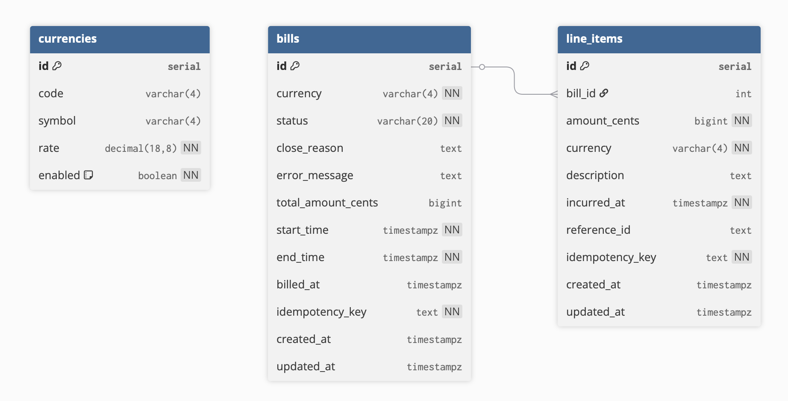

# Bill System design

Created by: Huy Du <br/>
Created time: August 27, 2025 9:45 PM<br/>
Last updated time: September 16, 2025 9:47 PM<br/>

## Testing

The project provides multiple layers of tests to validate behavior:

| Layer | Command | Purpose |
|-------|---------|---------|
| Unit & workflow | `make test` | Go unit tests + Temporal workflow tests via `encore test` |
| Coverage | `make test-coverage` | Generates `coverage.html` |
| **Complete Test Suite** | `./test_commands/run_all_tests.sh` | **🚀 Automated comprehensive API testing** |
| Individual API tests | Various scripts in `test_commands/` | Manual testing of specific features |

### 🎯 **For Reviewers: Complete Test Suite**

**⚡ Quick Start (Recommended)**
```bash
# Start the service (in one terminal)
encore run

# Run all tests (in another terminal)
./test_commands/run_all_tests.sh
```

This runs a **comprehensive automated test suite** that covers:
- ✅ Bill creation and idempotency
- ✅ Line item addition with currency conversion
- ✅ Complete end-to-end billing flow
- ✅ Concurrent operations and race conditions
- ✅ Error handling and validation

**Expected Output**: All tests should pass with green `[PASS]` messages and a final summary.

---

### 📋 Individual Test Scripts

All test scripts are fully automated and self-contained (no manual input required):

| Script | Description | What It Tests |
|--------|-------------|---------------|
| **`run_all_tests.sh`** | **Complete automated test suite** | **All features with timing and pass/fail tracking** |
| `01_create_bill.sh` | Interactive bill creation | Manual bill creation workflow (requires user input) |
| `02_add_line_items.sh` | Add line items to existing bill | Currency conversion, validation (requires bill ID) |
| `03_race_condition_test.sh` | Race condition testing | Concurrent line item additions (requires bill ID) |
| `04_idempotency_test.sh` | **Idempotency validation** | **Duplicate request handling with same idempotency key** |
| `05_error_tests.sh` | **Error handling validation** | **API validation, missing headers, invalid data** |
| `06_complete_flow.sh` | **End-to-end billing flow** | **Create → Add Items → Check Status → Close bill** |
| `07_concurrency_test.sh` | **Concurrent operations** | **Race conditions, database locking, timeout handling** |

### 🔍 **Detailed Test Descriptions**

#### **Core Automated Tests** (run by `run_all_tests.sh`)

**1. Idempotency Test (`04_idempotency_test.sh`)**
- Tests that duplicate API calls with same idempotency key return the same bill ID
- Validates that the system prevents duplicate bill creation
- **Expected**: Second call returns same bill ID as first call

**2. Error Handling Tests (`05_error_tests.sh`)**
- Tests various error conditions and API validation:
  - Invalid bill ID (404 error)
  - Missing idempotency key (400 error)
  - Invalid currency (400 error)
  - End time before start time (400 error)
  - Start time in the past (400 error)
- **Expected**: All tests return appropriate 4xx HTTP status codes

**3. Complete End-to-End Flow (`06_complete_flow.sh`)**
- Full billing lifecycle test:
  1. Creates active bill (USD currency, immediate start)
  2. Adds 5 line items (5000, 3000, 2000, 1500, 1000 cents = 12500 total)
  3. Fetches bill status and verifies total amount matches
  4. Closes the bill and verifies closure
- **Expected**: Total amount = 12500 cents, bill successfully closed

**4. Concurrency Tests (`07_concurrency_test.sh`)**
- Creates fresh bills for each test to avoid state conflicts
- Test 1: Concurrent AddLineItem vs CloseBill operations
- Test 2: Rapid-fire concurrent operations (5 simultaneous requests)
- **Expected**: Proper handling of race conditions, timeout errors, or logical errors

#### **Interactive Tests** (require manual input)

**5. Create Bill (`01_create_bill.sh`)**
- Interactive bill creation with user input for currency
- Demonstrates manual workflow
- **Usage**: `./01_create_bill.sh` (follow prompts)

**6. Add Line Items (`02_add_line_items.sh`)**
- Adds line items with different currencies to existing bill
- Tests currency conversion (GEL→USD, JPY→USD, EUR→USD)
- **Usage**: `./02_add_line_items.sh <bill_id>`

**7. Race Condition Test (`03_race_condition_test.sh`)**
- Tests concurrent line item additions to same bill
- **Usage**: `./03_race_condition_test.sh <bill_id>`

### 🛠 **Running Individual Tests**

```bash
# Automated tests (no input required)
./test_commands/04_idempotency_test.sh
./test_commands/05_error_tests.sh
./test_commands/06_complete_flow.sh
./test_commands/07_concurrency_test.sh

# Interactive tests (require input)
./test_commands/01_create_bill.sh
./test_commands/02_add_line_items.sh <bill_id>
./test_commands/03_race_condition_test.sh <bill_id>
```

### 🔧 **Technical Implementation**

**Test Infrastructure**:
- `lib.sh`: Shared utilities for API calls, JSON parsing, assertions
- All tests use `jq` for JSON processing and validation
- Proper error handling with meaningful failure messages
- HTTP status code validation
- Response time tracking in comprehensive suite

**API Testing Patterns**:
1. **Idempotency**: Every state-changing request uses unique idempotency keys
2. **Assertions**: `assert_json`, `assert_nonempty`, `assert_status` for validation
3. **Currency Conversion**: Tests multi-currency line items with USD bills
4. **Race Conditions**: Concurrent operations with timeout and lock testing
5. **Error Scenarios**: Comprehensive validation error testing

### 📊 **Expected Test Results**

When running `./test_commands/run_all_tests.sh`, you should see:

```
===============================================
           BILLING SERVICE TEST SUITE
===============================================
🚀 Running comprehensive automated tests

TEST 1: Idempotency Test
[PASS] Idempotency verified (bill id reused)

TEST 2: Error Handling Tests
[PASS] All error tests returned expected 4xx status codes

TEST 3: Complete End-to-End Flow
[PASS] Bill created, items added, total verified, bill closed

TEST 4: Concurrency Tests
[PASS] Concurrent operations handled correctly

📊 Tests run: 4
✅ Tests passed: 4
❌ Tests failed: 0
🎉 All tests passed!
```

### 🚨 **Troubleshooting**

**Common Issues**:
- **Service not running**: Ensure `encore run` is active on port 4000
- **Date/timezone errors**: Tests use UTC timestamps and may fail with incorrect system time
- **Permission errors**: Ensure test scripts are executable (`chmod +x test_commands/*.sh`)
- **Missing dependencies**: Tests require `curl`, `jq`, and `bash`

**Legacy Test Commands** (for backward compatibility):
```bash
make test-scripts  # Runs basic scripted tests
```

---

# Self research about Encore and Temporal

This section is for my self-learning about this new framework and technology. You can skip it into the next section for focusing on the homework.

## Encore

It make me feel like Ruby on Rails for Golang with the next level of simplicity for modern sophisticated applications. Reduce significantly amount of common coding semantic things such as define API, pubsub, workers, cronjobs, secret, database integration, monitoring, tracing, visualized diagrams, etc.

### Concept

- Support productive Local Development including testing with built-in tools that mimic the production infrastructure.
- DevOps friendly for developer: automatic infra provisioning, built-in metrics, tracing & monitoring.
- Automatic documentation & architecture diagrams by code.

### Features

- Turn any function into an API with a single annotation
- Built-in integration for database, pubsub, cache, cronjob, secrets — like plug and play.
- Automatically generate architecture diagrams, visualized tracing.

## Temporal

Help to dealing with complication of distributed system by guarantee durable execution.

- Built-in retries and timeouts mechanism
- Automatically maintains application state and recovers from failure

### Features

- **Workflows** are
    - fundamental building block for business logic, benefit from the durable execution of Temporal.
    - stateful and resilient to failure. they’re able to running for long periods of time
- **Activities** are functions for used for failure-prone operations. Basically it’s Workflow execution.
- **Temporal Service** manages and tracks related to Workflows and Activities
    - maintain and durably persists the Event History for each execution
- **Temporal Worker** responsible for executing Workflow and Activity code
    - polls for tasks and communicates status with Temporal Service
- **Temporal Signal** is an asynchronous message sent to a running Workflow Execution to change its state and control its flow

# Background

## Functional Requirement

### Use cases

The workflow started at the beginning of a fee period, at the end of the billing period, the total invoice and bill summation should be available. It mean the bill will be created with specified start date and end date. Therefore, I won’t cover recurring billing rule, just focus on single bill in this design. 

#### 1. **As a user I want to Create new bill with a defined billing period and currency.** Analysis requirements:
##### a. **Multi-Currency Support (USD/GEL)**: 
<details>
<summary><b>Analysis</b></summary>
“Able to handle different types of currency, for the sake of simplicity, assume GEL and USD”. In the realworld scenario, most billing system typically require invoices in single currency for legal/tax purposes. So Bill is in either USD or GEL. In my interpretation, for support multi-currency:
            
- Interpretation 1: Line Item currency must match bill currency.
- Interpretation 2: Same bill can have different currency Line Item. Therefore, bill total needs conversion/consolidation.
- Interpretation 3: For example Bill is in in USD, but user can pay in GEL. Therefore, system need to handle FX conversion.
            
In requirement 4, it only mention “Reject line item addition if bill is closed”, I assume no rejection if the Line Item currency is not match Bill currency. So the same Bill can have different currency Line Item (Interpretation 2). I think it’d be helpful if we also handle the Interpretation 3 to make our Fees API more flexible and complete. However, handling FX conversion quite complex and include volatility risk, so I will only using FIXED conversion rate in this coding challenge as USD to GEL is 2.70 as limited scope for homework.
</details>
<br/>
<b>Assumption</b>: Bill is in either USD or GEL. Line Item could be multi-currency. Conversion/Consolidation will be calculated when bill is closed with fixed conversion rate
        
##### b. **Billing Period Consideration**: 
<details>
<summary><b>Analysis</b></summary>
Base on the requirement that “workflow started at the beginning of a fee period” and “at the end of the billing period, invoice and bill summation should be available”, this suggest:
            
- There are a defined start and a defined end
- Period doesn’t specify
    - Fixed intervals or arbitrary
    - Each period must be continuous or can have gaps among periods.
    - Any duration constraints
            
Given the homework requirements are intentionally open-ended, I’m designing for the most flexible primitive model/feature that meets the core requirement and open to extend to any further requirements such as recurring, fixed period, calendar alignment (beginning of month, end of month, etc.), etc. 
</details>
<br/>
<b>Assumption</b>: Billing period can be any length that has a defined start date and end date with UTC time for support global customers. The start and end time must meet following constraints:        
- Start time must be either now or future.
- End time must be greater than start time.
    
##### c. **Bill Creation** contains following parameters:
- Start time
    - must be in the future
    - nil - indicate start immediately
- End time
    - must be in the future and greater than start time
        
<b>Assumption</b>:         
- The future timing currently don’t have any limit time, so basically user can create infinite time in the future, so that I will limit it within 30 days.
- We do support international timezone, but handle it in this homework will be overkilled. Therefore, all timing will use UTC.
- Imagine user have multiple bank account, and each bank account may charge different fee rate depend on the account type. Therefore, for one user they have multiple concurrent open bill.
        
<b>Constraints</b>:
- Cannot create bills for past periods
- Cannot add line items outside active period (Requirement 4)

#### 2. **As a user, I want to add line item to existing open bills to progressively accumulate fees throughout the billing period.** 

In the scope of homework, I choose to have minimal line item. The line item could be in any supported currencies (USD/GEL) and will convert amount to match with bill currency.
```json
{
	"bill_id": "bill_id",
	"currency": "USD", 
    "amount_cents": 2550,
    "description": "Wire transfer fee",
    "reference_id": "txn_123",       
    "created_at": "2024-01-15T10:30:00Z",
    "metadata": {
	  "original_amount_cents": 5000,
	  "original_currency": "GEL",
	  "exchange_rate": 0.37
    }
}
```
    

#### 3. **As a user, I want to close an active bill to finalize charges with all line items. The additional line item that add after bill is closed will be rejected.**

<b>Assumption</b>:
- Bill becomes immutable after user make close request.
- Perform final calculations.
- Handle different types of currency (Requirement 6)
    - For Line Item
    - Bill could be paid in different currency, but because homework didn’t mention it. Therefore, we won’t do the currency conversion for the final bill amount.
- Possible triggers could be:
    - Scheduled base on the end_time reached
    - Manual by user requests

<b>Extra cases</b>:

- Bill is active but no fees accrued. No specific requirement, so we will allow to close it.
- Bill is pending. User should able to close.
- Bill calculation failed or infrastructure failure. It should indicate with `attention_required` status.

#### 4. **As a user, I want to query open and closed bill.**

<b>Assumption</b>:
- Return bill information with given bill id.
- In the realworld application, the user only able to query the bills of themself. In the limited scope of homework, we won’t handle the authentication and authorization.

# Design

## Database Model



### Bills table

The `bills` table stores information about each customer's bill. A single record represents a billing period for a user, tracking its overall status, total amount due, and key timestamps. This table is the central hub for managing the billing cycle.

| Attribute | Data Type | Constraints | Description |
| --- | --- | --- | --- |
| id | serial | primary key | A unique, auto-increment integer for each bill. I use integer for better performance and less storage. The tradeoff is more susceptible to enumeration attracts but we can prevent it by authentication and authorization layer base on user token. |
| currency | varchar(4) | not null | ISO 4217 currency code (e.g: USD, GEL) |
| status | varchar(20) | not null | The current state of bill. Statuses are: `pending`, `active`, `closing`, `closed`, `cancelled`, `failed`. 
Using integer could have better performance and less storage, but in homework scope I want to use text for clarity, we can consider migrate it into integer if required in the future. |
| close_reason | text | nullable | Closure reason capture the transition whether `manual_close`, `automatic_close`, `close_before_start`, etc. |
| error_message | text | nullable | Error details when the closing is failed. |
| total_amount_cents | bigint | nullable | The total amount of bill, stored in smallest currency unit. Rationale: Using `bigint` for financial data is critical to avoid floating-point inaccuracies and precision errors. We will ensure the currency conversion will be happen at application layer, and store the rounded amount into DB. |
| start_time | timestampz | not null | The start time of billing period. Using timestamp with timezone and store in UTC. |
| end_time | timestampz | not null | The end time of billing period. Using timestamp with timezone and store in UTC. |
| billed_at | timestampz | nullable | The timestamp when the bill is closed. Using timestamp with timezone and store in UTC. |
| idempotency_key | text | not null, unique | A unique key generated by client to prevent duplicate bill creation requests. Rationale: making this a required and unique field is a strict safety measure to ensure that a bill is only created once, even if the client retries the request. |
| created_at | timestampz | nullable | Automatically populated when record created |
| updated_at  | timestampz | nullable  | Automatically populated when record updated |

**Bill State Machine**


### Line Items table

The `line_items` table stores individual charges that make up a single bill. Each record represents a specific fee, transaction, or event that occurred within a billing period.

| Attribute | Data Type | Constraints | Description |
| --- | --- | --- | --- |
| id | serial | primary key | A unique, auto-incrementing identifier for each line item. |
| bill_id | int | foreign key | Referencing bills.id |
| currency | varchar(4) | not null | ISO 4217 currency code (e.g: USD, GEL) |
| amount_cents | bigint | nullable | The monetary value of the line item, stored in the smallest currency unit. Rationale: Consistent with the `bills` table, using `bigint` prevents floating-point inaccuracies for financial data. It is `NOT NULL` to ensure every line item has a value. |
| description | text | nullable | Human-readable description of the charge (e.g., `'Subscription Fee'`, `'Payment Processing'`). `text` is a good choice for potentially long strings of text. |
| incurred_at | timestampz | not null | The specific time the charge was incurred. `timestampz` ensures accuracy across different time zones and is vital for chronological auditing. |
| reference | text | nullable | An optional reference to an external system, such as a transaction ID from a payment gateway. `text` provides flexibility for various external formats. |
| idempotency_key | text | not null, unique | A unique client-generated key for preventing duplicate line item additions. Rationale: Similar to the `bills` table, this is a critical safeguard for state-changing financial operations. It is `NOT NULL` to enforce its presence and ensure data consistency. |
| metadata | jsonb | default: {} | The metadata storing extra information of line item (e.g: store original amount_cents in different currency with the bill) `{ original_amount_cents: 1000, original_currency: GEL, exchange_rates: 0.3331 }` |
| created_at | timestampz | nullable | Automatically populated when record created |
| updated_at  | timestampz | nullable  | Automatically populated when record updated |

### Currencies table

The `currencies` table acts as a reference for all supported currencies within the system. It stores the currency's code, symbol, and a fixed rate relative to a base currency (USD).

| Attribute | Data Type | Constraints | Description |
| --- | --- | --- | --- |
| id | serial | primary key | A unique, auto-incrementing identifier for each currency. |
| code | varchar(4) | not null, unique | The standard ISO 4217 currency code. The `UNIQUE`constraint ensures no two currencies share the same code. |
| symbol | varchar(4) | nullable | The symbol of currency (e.g: **`$`, `₾`)** |
| rate | decimal(18,8) | not null | A fixed exchange rate relative to a base currency (USD). Rationale: `decimal` is the correct data type for exchange rates, as it provides high precision and avoids floating-point errors. A precision of `18` and scale of `8` is robust enough for most currencies. In this scope of this homework, this rate will be fixed and never change. |
| enabled | boolean | not null, default: false | A flag indicating whether the currency is active and can be used in the system. |
| created_at | timestampz | nullable | Automatically populated when record created |
| updated_at  | timestampz | nullable  | Automatically populated when record updated |


# High Level Diagrams


## Architecture layers and Responsibilities

### Middleware Layer - Idempotency

- Responsibility: Ensure request is applied only once, even if request received multiple times due to network retries or other issues.
- Sequence diagram


**Implementation Notes:**
- In a real-world scenario, the idempotency middleware would require distributed locking to prevent race conditions. For simplicity, distributed lock implementation was intentionally omitted, so this middleware only handles sequential duplicate requests correctly.
- **MD5 Hashing Rationale**: The middleware uses MD5 for request body hashing, which is appropriate for this use case because:
  - This is **not a cryptographic security operation** - we're only detecting if request bodies are identical
  - MD5 provides excellent performance for high-frequency idempotency checks
  - Even in the extremely rare case of MD5 collisions, the worst outcome is treating different requests as duplicates, which would be caught by business logic validation
  - We're hashing structured JSON data in a controlled environment, not arbitrary content where collision attacks are feasible

### API Layer - Encore Service

- Handler: Receives HTTP requests, validates input
- Responsibility: Protocol concerns, serialization

### Business Service Layer

- Bill Service: Business orchestration, error handling
- Responsibility: Coordinate domain operations, manage dependencies, easy to change framework (migrate from Encore)

### Domain Layer

- BillStateMachine: Complex domain operations, transaction management
- State Machine Logic:
    - State transitions with row locking to prevent race condition
    - Transaction management for strong consistency operations
- Responsibility: Domain logic, atomicity, consistency and aggregate logic between Bill and LineItems Repository

### Repository Layer

- Use sqlc-generated queries - Clean, type-safe SQL operations

### Temporal workflow

- Temporal Client: Workflow execution
- BillingPeriodWorkflow: Async lifecycle management
- Responsibility: Time-based operations, signals

## Billing Complete LifeCycle Flow


## API Contracts

### 1. Create a new bill

Endpoint: `POST /v1/bills`

Description: Create a new bill for a user in specified currency and period.

Request body:

- Required parameters:
    - `currency` : type string — currency code (ISO-4217)
    - `end_time` : type string — timestamp (ISO-8601)
- Optional parameters:
    - `start_time` : type string — timestamp (ISO-8601)
        - `start_time` is null mean start the bill immediately.

```json
{
	"currency": "GEL",
	"start_time": "2025-09-06T03:00:00+0000", // could be null
	"end_time": "2025-10-06T03:00:00+0000",
}
```

Required Header:

- `X-Idempotency-Key` : type text — unique key generated by client

Response:

- Success request
    - Status Code: `201` -  Created
    - Response body:
    
    ```json
    {
    	"bill_id": "1",
      "currency": "GEL",
      "status": "pending",
      "total_amount_cents": 0,
      "start_time": "2025-09-06T03:00:00Z",
      "end_time": "2025-10-06T03:00:00Z",
      "created_at": "2025-09-06T02:30:00Z",
      "line_items": []
    }
    ```
    
    - Response header:
        - `X-Idempotency-Key: "1af534c9-6f44-4efb-91d8-13ad743e2526"`
- Error - Missing `X-Idempotency-Key` header
    - Status Code: `422` - Unprocessable Entity
    - Error response sample
    
    ```json
    {
    	"code": "idempotency_key_required",
    	"message": "The 'Idempotency-Key' header is required for this operation."
    }
    ```
    
- Error - Invalid parameters
    - Status Code: `400` - Bad request
    - Error response sample
    
    ```json
    {
    	"code": "invalid_argument",
    	"message": "end_time must be greater than start_time"
    }
    ```
    

### 2. Add line item to bill

Endpoint: `POST /v1/bills/{bill_id}/line_items`

Description: Create line item with given active bill

Path parameter: `bill_id` - type integer

Request body:

- Required parameters:
    - `currency` : type string — currency code (ISO-4217)
    - `amount_cents` : type integer
    - `description`: type string
    - `reference_id`: unique identifier of line item

```json
{
	"currency": "GEL",
    "amount_cents": 1000,
    "description": "Pavebank fee",
    "reference_id": "abc123"
}
```

Required Header:

- `X-Idempotency-Key` : type text — unique key generated by client

Response:

- Success request
    - Status Code: `201` -  Created
    - Response body:
    
    ```json
    {
        "line_item": {
            "id": 1,
            "bill_id": 1,
            "amount_cents": 1000,
            "currency": "USD",
            "description": "Pave bank fee",
            "incurred_at": "2009-11-10T23:00:00Z",
            "reference_id": "pavebank_abc_123",
            "metadata": {
                "original_amount_cents": 2650,
                "original_currency": "GEL",
                "exchange_rate": 2.65
            },
            "idempotency_key": "idempotency_key123",
            "created_at": "2009-11-10T23:00:00Z",
            "updated_at": "2009-11-10T23:00:00Z",
        }
    }
    ```
    
    - Response header:
        - `X-Idempotency-Key: "1af534c9-6f44-4efb-91d8-13ad743e2526"`
- Error - Missing `X-Idempotency-Key` header
    - Status Code: `422` - Unprocessable Entity
    - Error response sample
    
    ```json
    {
    	"code": "idempotency_key_required",
    	"message": "The 'Idempotency-Key' header is required for this operation."
    }
    ```
    
- Error - Invalid parameters
    - Status Code: `400` - Bad request
    - Error response sample
    
    ```json
    {
      "code": "invalid_argument",
      "message": "bill is not in active state for adding line items"
    }
    ```
    

### 3. Close bill

Endpoint: `POST /v1/bills/{bill_id}/close`

Description: Close a bill

Path parameter: `bill_id` - type integer

Request body:

- Required parameters:
    - `reason` : type string — closure reason

```json
{
	"reason": "Manual close"
}
```

Required Header:

- `X-Idempotency-Key` : type text — unique key generated by client

Response:

- Success request
    - Status Code: `201` -  Created
    - Response body:
    
    ```json
    {
        "bill": {
            "id": 1,
            "currency": "GEL",
            "status": "closed",
            "close_reason": "Autoclose",
            "error_message": "", // omitempty
            "total_amount_cents": 1000,
            "start_time": "2009-11-10T23:00:00Z",
            "end_time": "2009-11-10T23:00:00Z",
            "billed_at": "2009-11-10T23:00:00Z", // omitempty
            "idempotency_key": "abc123",
            "workflow_id": "workflow-id",
            "line_items": [{
                "id": 1,
                "bill_id": 1,
                "amount_cents": 1000,
                "currency": "GEL",
                "description": "Pavebank fee",
                "incurred_at": "2009-11-10T23:00:00Z",
                "reference_id": "reference_id",
                "metadata": { // omitempty
                    "original_amount_cents": 0,
                    "original_currency": "",
                    "exchange_rate": 0.0
                },
                "idempotency_key": "abc125",
                "created_at": "2009-11-10T23:00:00Z",
                "updated_at": "2009-11-10T23:00:00Z",
            }],
            "created_at": "2009-11-10T23:00:00Z",
            "updated_at": "2009-11-10T23:00:00Z"
        }
    }
    ```
    
    - Response header:
        - `X-Idempotency-Key: "1af534c9-6f44-4efb-91d8-13ad743e2526"`
- Error - Missing `X-Idempotency-Key` header
    - Status Code: `422` - Unprocessable Entity
    - Error response sample
    
    ```json
    {
    	"code": "idempotency_key_required",
    	"message": "The 'Idempotency-Key' header is required for this operation."
    }
    ```
    
- Error - Invalid parameters
    - Status Code: `400` - Bad request
    - Error response sample
    
    ```json
    {
      "code": "invalid_argument",
      "message": "bill is not in active state for adding line items"
    }
    ```
    

### 4. Get bill

Endpoint: `GET /v1/bills/{bill_id}`

Description: Retrieve a bill information

Path parameter: `bill_id` - type integer

Response:

```json
{
    "bill": {
        "id": 0,
        "currency": "",
        "status": "",
        "close_reason": "",
        "error_message": "",
        "total_amount_cents": 0,
        "start_time": "2009-11-10T23:00:00Z",
        "end_time": "2009-11-10T23:00:00Z",
        "billed_at": "2009-11-10T23:00:00Z",
        "idempotency_key": "",
        "workflow_id": "",
        "line_items": [{
            "id": 0,
            "bill_id": 0,
            "amount_cents": 0,
            "currency": "",
            "description": "",
            "incurred_at": "2009-11-10T23:00:00Z",
            "reference_id": "",
            "metadata": {
                "original_amount_cents": 0,
                "original_currency": "",
                "exchange_rate": 0.0
            },
            "idempotency_key": "",
            "created_at": "2009-11-10T23:00:00Z",
            "updated_at": "2009-11-10T23:00:00Z",
        }],
        "created_at": "2009-11-10T23:00:00Z",
        "updated_at": "2009-11-10T23:00:00Z"
    }
}
```

### 5. List bills

Endpoint: `GET /v1/bills`

Description: Retrieve list of bills

Query parameters:

- `limit` : type integer
- `offset` : type integer

Response:

```json
{
    "bills": [{
        "id": 0,
        "currency": "",
        "status": "",
        "close_reason": "",
        "error_message": "",
        "total_amount_cents": 0,
        "start_time": "2009-11-10T23:00:00Z",
        "end_time": "2009-11-10T23:00:00Z",
        "billed_at": "2009-11-10T23:00:00Z",
        "idempotency_key": "",
        "workflow_id": "",
        "line_items": [{
            "id": 0,
            "bill_id": 0,
            "amount_cents": 0,
            "currency": "",
            "description": "",
            "incurred_at": "2009-11-10T23:00:00Z",
            "reference_id": "",
            "metadata": {
                "original_amount_cents": 0,
                "original_currency": "",
                "exchange_rate": 0.0
            },
            "idempotency_key": "",
            "created_at": "2009-11-10T23:00:00Z",
            "updated_at": "2009-11-10T23:00:00Z",
        }],
        "created_at": "2009-11-10T23:00:00Z",
        "updated_at": "2009-11-10T23:00:00Z"
    }],
    "total_count": 0,
    "limit": 0,
    "offset": 0
}
```

# Encore Server

## Prerequisites 

**Install Encore:**
- **macOS:** `brew install encoredev/tap/encore`

**Install Temporal**
- **macOS:** `brew install temporal`

**Install sqlc**
- **macOS:** `brew install sqlc`

## Generate SQL queries
Run this command from your application's root folder:
```bash
sqlc generate
```

## Run app locally

Run this command from your application's root folder:

- Start Temporal
```bash
temporal server start-dev
```

- Start Encore Server

```bash
encore run
```

## Testing

The project includes both unit tests and integration tests for comprehensive coverage.

### Unit Tests
Run unit tests (fast, no database required):
```bash
make test
# or
encore test ./... -v
```

### Test Coverage
Generate coverage report:
```bash
make test-coverage
```

