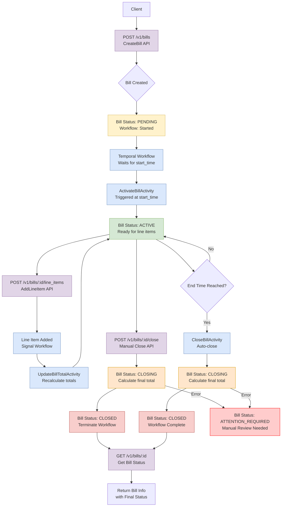
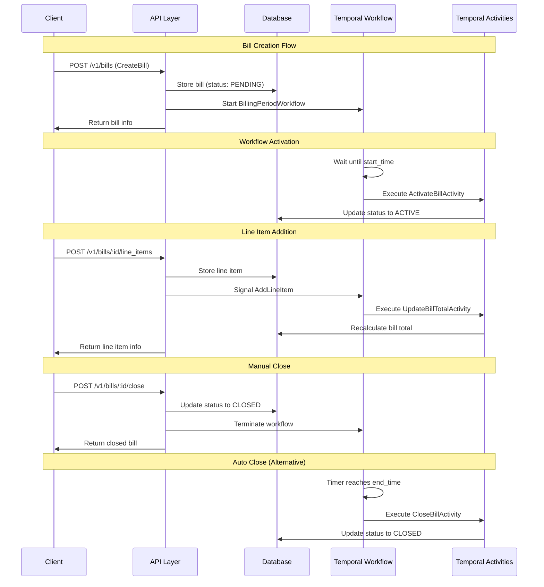

# Bill Lifecycle Diagram - README Documentation

## Bill State Transitions and API Flow



## Bill States and Transitions

| State | Description | Possible Transitions | Trigger |
|-------|-------------|---------------------|---------|
| **PENDING** | Bill created, waiting for start_time | → ACTIVE<br/>→ CLOSED | Workflow timer<br/>Manual close |
| **ACTIVE** | Bill is active, accepting line items | → CLOSING<br/>→ CLOSED | Auto-close timer<br/>Manual close |
| **CLOSING** | Bill being finalized, calculating totals | → CLOSED<br/>→ ATTENTION_REQUIRED | Success<br/>Error in processing |
| **CLOSED** | Bill finalized, no more changes | _(Terminal state)_ | N/A |
| **ATTENTION_REQUIRED** | Error state, needs manual review | → CLOSED | Manual intervention |

## API Endpoints and Their Role

### 1. **CreateBill API** - `POST /v1/bills`
```
┌─────────────┐    ┌──────────────┐    ┌─────────────┐
│   Client    │───▶│ Create Bill  │───▶│   Temporal  │
│             │    │   Service    │    │  Workflow   │
└─────────────┘    └──────────────┘    └─────────────┘
                           │
                           ▼
                   ┌──────────────┐
                   │ Bill Status: │
                   │   PENDING    │
                   └──────────────┘
```

### 2. **AddLineItem API** - `POST /v1/bills/:id/line_items`
```
┌─────────────┐    ┌──────────────┐    ┌─────────────┐
│   Client    │───▶│ Add Line Item│───▶│   Signal    │
│             │    │   Service    │    │  Workflow   │
└─────────────┘    └──────────────┘    └─────────────┘
                           │                    │
                           ▼                    ▼
                   ┌──────────────┐    ┌─────────────┐
                   │  Line Item   │    │Update Total │
                   │    Stored    │    │  Activity   │
                   └──────────────┘    └─────────────┘
```

### 3. **CloseBill API** - `POST /v1/bills/:id/close`
```
┌─────────────┐    ┌──────────────┐    ┌─────────────┐
│   Client    │───▶│  Close Bill  │───▶│ Terminate   │
│             │    │   Service    │    │  Workflow   │
└─────────────┘    └──────────────┘    └─────────────┘
                           │
                           ▼
                   ┌──────────────┐
                   │ Bill Status: │
                   │   CLOSED     │
                   └──────────────┘
```

### 4. **GetBill API** - `GET /v1/bills/:id`
```
┌─────────────┐    ┌──────────────┐    ┌─────────────┐
│   Client    │───▶│   Get Bill   │───▶│  Database   │
│             │    │   Service    │    │    Query    │
└─────────────┘    └──────────────┘    └─────────────┘
                           │
                           ▼
                   ┌──────────────┐
                   │ Return Bill  │
                   │ with Status  │
                   └──────────────┘
```

## Workflow Integration



## Key Features

### 🔒 **Concurrency Control**
- Row-level locking prevents race conditions
- 5-second timeout prevents hanging requests
- Proper error handling for lock conflicts

### 🔄 **Idempotency**
- All APIs support idempotency keys
- Duplicate requests return cached responses
- Body hash validation prevents key reuse

### ⚡ **Async Processing**
- Workflow signals don't block API responses
- Background total recalculations
- Non-blocking workflow termination

### 🛡️ **Error Handling**
- Timeout errors with clear messages
- Graceful degradation on failures
- ATTENTION_REQUIRED state for manual review

## Testing the Lifecycle

1. **Create a bill**: `./test_commands/01_create_bill.sh`
2. **Add line items**: `./test_commands/02_add_line_items.sh <bill_id>`
3. **Check bill status**: `curl GET /v1/bills/<bill_id>`
4. **Close manually**: `./test_commands/05_close_bill.sh <bill_id>`
5. **Test concurrency**: `./test_commands/07_concurrency_test.sh <bill_id>`